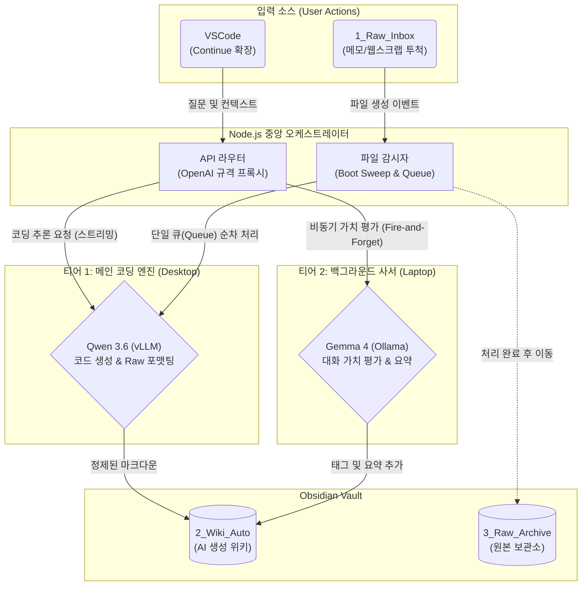

# Local AI Second Brain Server

> **VSCode 코딩 비서(Continue)**와 **Obsidian 지식 보관소(Vault)**를 통합하여, 개발자의 개입 없이 지식을 선별하고 마크다운 위키로 자동 정리하는 로컬 분산형 LLM 프록시 서버입니다.

## 프로젝트 개요 (Overview)

개발 과정에서 발생하는 수많은 질문과 해결책, 그리고 웹 서핑 중 수집하는 파편화된 정보들은 기록되지 않으면 쉽게 휘발됩니다. 매번 이를 직접 노션이나 옵시디언에 정리하는 것은 개발 흐름(Flow)을 끊는 주된 원인이 됩니다.

본 프로젝트는 이러한 문제를 해결하기 위해 고안된 **자동화된 지식 관리(PKM) 파이프라인**입니다. 
사용자는 평소처럼 VSCode에서 코딩을 하거나 폴더에 메모를 던져두기만 하면 됩니다. 백그라운드에 배치된 두 개의 로컬 AI 모델(Qwen, Gemma)이 협포하여 정보의 가치를 스스로 판단하고, 영구적으로 보관할 가치가 있는 내용만 정제된 위키 문서로 자동 생성합니다.

---

## 시스템 아키텍처 (System Architecture)



## 핵심 기능 (Main Features)

### 1. 지연 없는 코딩 비서 (Zero-Latency Proxy)
Node.js 서버는 VSCode의 API 요청을 **vLLM(Qwen)**으로 직접 라우팅하고 스트리밍 응답을 즉시 전달합니다. 중간 처리 대기 시간이 없어 로컬 LLM의 최대 속도를 그대로 체감할 수 있습니다.

### 2. AI 수문장 패턴 (Smart Gatekeeper)
모든 대화를 무분별하게 저장하지 않습니다. 메인 응답이 완료된 후, **Gemma**가 백그라운드에서 대화의 가치를 평가합니다.
- **SKIP**: 단순 오타 수정, 일회성 질문 등은 즉시 폐기.
- **SAVE**: 재사용 가능한 로직, 아키텍처 설계 등은 완벽한 위키 문서로 변환하여 저장.

### 3. 비동기 정보 정제 (Auto-Wiki Generation)
`1_Raw_Inbox` 폴더에 난잡한 텍스트나 로그를 넣어두면, AI가 맥락을 분석하여 목차와 요약이 포함된 구조화된 문서를 생성하고 `2_Wiki_Auto`로 이동시킵니다.

### 4. 📂 하이브리드 파일 감시 (Hybrid File Watcher)
- **부팅 스윕 (Boot Sweep)**: 서버 시작 시 누적된 파일을 순차적으로 처리하여 데이터 유실 방지.
- **실시간 큐 (Real-time Queue)**: 대량의 파일이 유입되어도 큐를 통해 하나씩 처리하여 메모리 폭주를 차단.

---

## 🛠️ 시작하기 (Getting Started)

### 1. 환경 변수 설정 (.env)
루트 디렉토리에 `.env` 파일을 생성하고 아래 표를 참고하여 설정합니다.

| 변수명 | 설명 | 예시 |
| :--- | :--- | :--- |
| `PORT` | 서버 포트 | `3000` |
| `OBSIDIAN_BASE_PATH` | 옵시디언 보관소 절대 경로 | `C:/Users/Docs/Vault` |
| `VLLM_BASE_URL` | Qwen 서빙 주소 (vLLM/OpenAI 호환) | `http://192.168.0.10:8000/v1` |
| `VLLM_QWEN_MODEL` | 사용할 메인 모델 명 | `qwen2.5-coder:32b` |
| `OLLAMA_BASE_URL` | Ollama API 주소 | `http://localhost:11434` |
| `OLLAMA_GEMMA_MODEL` | 가치 평가용 모델 명 | `gemma2:9b` |

### 2. 설치 및 실행
```bash
# 의존성 설치
npm install

# 서버 실행
node server.js
```

---

## 📂 프로젝트 구조 (Project Structure)

```text
/
┣ 📂 config/      # 환경 변수 및 AI 프롬프트 관리
┣ 📂 routes/      # OpenAI API 호환 라우팅 (Chat Proxy)
┣ 📂 services/    # File Watcher, LLM 연동, Wiki 생성 로직
┣ 📜 server.js    # 애플리케이션 진입점
┗ 📜 .env         # 시스템 설정 파일
```

---

## 활용 시나리오 (Use Cases)

> **Case A: 코딩 중 자동으로 지식 축적**
> 1. VSCode에서 복잡한 리팩토링 요청.
> 2. Qwen이 답변하는 동안 Gemma가 해당 정보를 분석.
> 3. 대화 종료 후 `2_Wiki_Auto/리팩토링_전략_20260520.md` 자동 생성.

> **Case B: 비동기 데이터 큐레이션**
> 1. 웹 서핑 중 유익한 텍스트를 `1_Raw_Inbox`에 저장.
> 2. 서버가 파일을 감지하여 AI 정제 시작.
> 3. `2_Wiki_Auto` 폴더에 정돈된 요약본 도착.